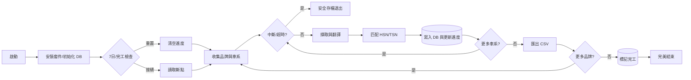
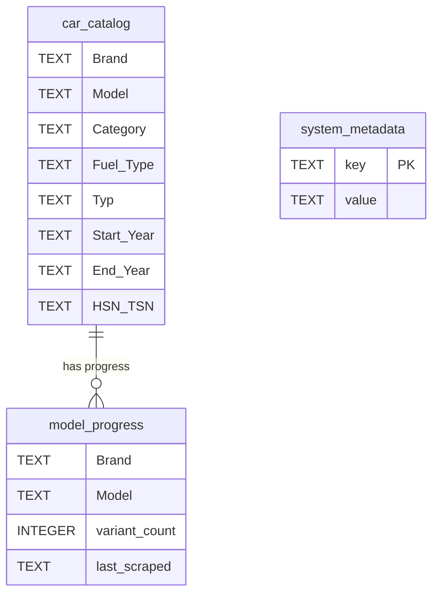

# AutoBild 爬蟲 v11.0

德國 AutoBild 汽車型錄爬蟲系統，自動擷取所有品牌、車系、車型資料。

## 功能特色

- ✅ 自動爬取所有品牌和車系
- ✅ 7天增量更新（重啟後自動跳過已爬取的車系）
- ✅ 自動展開所有變體
- ✅ 嘗試擷取 HSN/TSN
- ✅ 中文翻譯（車型、燃料類型）
- ✅ 自動安裝所需套件
- ✅ CSV 匯出

## 欄位說明

| 欄位 | 說明 |
|------|------|
| Brand | 品牌 |
| Model | 車系 |
| Category | 車型（已翻譯為中文） |
| Fuel_Type | 燃料類型（已翻譯為中文） |
| Typ | 規格名稱 |
| Start_Year | 開始年份 |
| End_Year | 結束年份 |
| HSN_TSN | 型式認證號碼 |

## 使用方式

### 本地執行（Mac/Linux）

```bash
python autobild_v11.py              # 完整掃描
python autobild_v11.py --test       # 測試模式
python autobild_v11.py --brand VW   # 只抓特定品牌
python autobild_v11.py --status     # 查看統計
python autobild_v11.py --reset      # 重置資料庫
```

### Windows

雙擊 `run_autobild.bat` 或執行：

```cmd
python autobild_win.py
```

### GitHub Actions（自動排程）

#### 完整設定步驟：

**步驟 1：建立 GitHub 倉庫**
1. 登入 GitHub
2. 點選右上角 `+` → `New repository`
3. 輸入倉庫名稱（例如：`autobild-scraper`）
4. 選擇 `Public` 或 `Private`
5. 點選 `Create repository`

**步驟 2：上傳程式碼到 GitHub**
```bash
# 在你的資料夾初始化 git
cd /Users/chi7/Desktop/opencode/9527
git init
git add .
git commit -m "AutoBild Scraper v11.0"

# 連結到你的 GitHub 倉庫
git remote add origin https://github.com/你的帳號/autobild-scraper.git
git branch -M main
git push -u origin main
```

**步驟 3：啟用 GitHub Actions**
1. 進入你的倉庫頁面
2. 點選 **Actions** 頁籤
3. 點選 **I understand my workflows, go ahead and enable them**

**步驟 4：設定 Actions 權限**
1. 到 **Settings** → **Actions** → **General**
2. 在 **Workflow permissions** 選擇：
   - **Read and write permissions**
3. 點選 **Save**

**步驟 5：手動觸發測試**
1. 到 **Actions** 頁籤
2. 選擇 **AutoBild Scraper**
3. 點選 **Run workflow**
4. 選擇 `main` 分支
5. 可以選擇特定品牌（留空爬全部）
6. 點選 **Run workflow**

**步驟 6：查看執行結果**
1. 在 **Actions** 頁籤會看到正在執行的 workflow
2. 點進去可以看即時 log
3. 執行完成後，到 **Artifacts** 下載 CSV 和資料庫

#### 排程設定

`.github/workflows/autobild.yml` 中的排程：

```yaml
on:
  schedule:
    - cron: '0 2 * * 0'  # 每週日凌晨 2 點 (UTC)
  workflow_dispatch:      # 允許手動觸發
  push:
    branches: [ main ]    # 推送到 main 分支時觸發
```

| 觸發方式 | 說明 |
|----------|------|
| `schedule` | 每週日自動執行 |
| `workflow_dispatch` | 手動按按鈕觸發 |
| `push` | 推送程式碼時觸發 |

#### 常用 cron 設定

```yaml
# 每天凌晨 2 點
- cron: '0 2 * * *'

# 每 6 小時
- cron: '0 */6 * * *'

# 週一到週五凌晨 2 點
- cron: '0 2 * * 1-5'

# 每月 1 號凌晨 2 點
- cron: '0 2 1 * *'
```

#### 下載執行結果

每次執行完成後：
1. 進入 **Actions** → 點選該次執行
2. 滾動到底部 **Artifacts** 區域
3. 下載：
   - `autobild-csv-{run_number}` - 所有品牌 CSV
   - `autobild-db-{run_number}` - 資料庫檔案

### Google Colab

1. 上傳 `autobild_github.py` 到 Colab
2. 執行腳本即可（會自動安裝套件）

## 檔案說明

| 檔案 | 說明 |
|------|------|
| `autobild_v11.py` | Mac/Linux 版本 |
| `autobild_win.py` | Windows 版本 |
| `autobild_github.py` | GitHub/Cloud 版本 |
| `run_autobild.bat` | Windows 啟動腳本 |
| `requirements.txt` | Python 套件清單 |
| `.github/workflows/autobild.yml` | GitHub Actions 設定 |

## 環境需求

- Python 3.8+
- 所有套件會自動安裝：
  - playwright
  - pandas
  - nest_asyncio

## 輸出

- 資料庫：`autobild_master.db`
- CSV：`AutoBild_Exports/` 目錄下，每個品牌一個檔案

## 注意事項

- 首次執行會自動安裝套件和 Chromium 瀏覽器
- 建議使用 VPN 或代理，避免被封鎖
- 完整掃描約需 3-5 小時
- 7天內重啟會自動跳過已爬取的車系

---

AutoBild 爬蟲系統 v11.0 流程圖
================================

【完整流程圖】

```mermaid
flowchart TD
    Start([啟動爬蟲]) --> InstallPkg[安裝套件]
    InstallPkg --> CheckCmd{檢查參數}
    
    CheckCmd -- reset --> ResetDB[(強制重置資料庫)] --> End
    CheckCmd -- status --> ShowStatus[(顯示統計)] --> End
    CheckCmd -- test --> SetTestMode[測試模式]
    CheckCmd -- brand --> SetBrand[品牌模式]
    CheckCmd -- 無參數 --> SetFullMode[完整掃描]
    
    SetTestMode --> InitDB
    SetBrand --> InitDB
    SetFullMode --> InitDB
    
    InitDB[(初始化資料庫)] --> CheckGlobal{檢查全域狀態\n(system_metadata)}
    
    CheckGlobal -- "已標記 completed\n或超過 7 天" --> ClearProgress[\清空舊進度/] --> LaunchBrowser
    CheckGlobal -- "7 天內未完成" --> ResumeMode[\讀取斷點接續掃描/] --> LaunchBrowser
    
    LaunchBrowser[啟動瀏覽器] --> CollectBrands[收集品牌]
    CollectBrands --> BrandLoop[品牌迴圈]
    
    BrandLoop --> CheckInterrupt1{中斷/超時檢查}
    CheckInterrupt1 -- "Ctrl+C 或超時" --> SafeStop([安全寫入並暫停])
    CheckInterrupt1 -- 否 --> EnterBrand[進入品牌]
    
    EnterBrand --> CollectModels[收集車系]
    CollectModels --> ModelLoop[車系迴圈]
    
    ModelLoop --> CheckInterrupt2{中斷/超時檢查}
    CheckInterrupt2 -- "Ctrl+C 或超時" --> SafeStop
    CheckInterrupt2 -- 否 --> CheckProgress2{檢查進度表}
    
    CheckProgress2 -- "已爬取完成" --> SkipModel[略過車系] --> ModelLoop
    CheckProgress2 -- "未爬取/未完" --> GotoModel[前往車系詳細頁]
    
    GotoModel --> ScrollPage[滾動載入] --> CheckVariants{檢查變體數量}
    
    CheckVariants -- 無變體 --> ExtractSingle[擷取單一規格]
    CheckVariants -- 有變體 --> ExpandAll[點擊展開全部變體] --> ExtractData[擷取多規格資料]
    
    ExtractSingle --> BuildRecords
    ExtractData --> BuildRecords[建構記錄]
    
    BuildRecords --> TranslateData[翻譯中文化] --> LoopRecords[遍歷變體寫入]
    
    LoopRecords --> CheckInterrupt3{中斷/超時檢查}
    CheckInterrupt3 -- "Ctrl+C 或超時" --> SafeStop
    CheckInterrupt3 -- 否 --> TryHSN{API 或 DOM\n擷取 HSN/TSN}
    
    TryHSN --> SetHSN[設定 HSN/TSN] --> AddBatch[加入暫存 Batch]
    
    AddBatch --> CheckBatch{批次滿 50 筆?}
    CheckBatch -- 是 --> SaveDB[(寫入資料庫)] --> LoopRecords
    CheckBatch -- 否 --> LoopRecords
    
    LoopRecords -- 該車系完成 --> FlushBatch[(強制寫入)] --> UpdateProgress[(更新進度表)]
    UpdateProgress --> ModelLoop
    
    ModelLoop -- 該品牌完成 --> ExportCSV[(匯出 CSV)] --> BrandLoop
    
    BrandLoop -- 全站掃描完成 --> MarkCompleted[(標記狀態為 completed)] --> CloseBrowser[關閉瀏覽器]
    SafeStop --> CloseBrowser
    
    CloseBrowser --> End([結束])
```

---

【簡化版流程圖】



---

【資料庫 Schema】



### 中文翻譯對照表 

#### 車型 (Category)

| 德文 | 中文 |
|------|------|
| fliessheck | 掀背車 |
| stufenheck | 斜背車 |
| stlheck_fliessheck | 斜掀背車 |
| steilheck_fliessheck | 高背掀背車 |
| limousine | 轎車 |
| suv | 休旅車 |
| cabrio | 敞篷車 |
| roadster | 敞篷跑車 |
| coupe | 雙門跑車 |
| kombi | 旅行車 |
| kasten | 貨車 |
| van | 廂型車 |
| bus | 巴士 |
| select | 精選型 |
| pritsche | 皮卡 |
| geländewagen | 越野車 |
| kleinwagen | 小型車 |

#### 燃料類型 (Fuel_Type)

| 德文 | 中文 |
|------|------|
| Benzin | 汽油 |
| Diesel | 柴油 |
| Elektro | 電動 |
| Elektrischer Strom | 電力 |
| Benzin/Hybrid | 油電混合 |
| Benzin/Elektro | 油電混合 |
| Benzin/Elektro-PlugIn | 插電式油電混合 |
| Benzin/Elektro-Plug | 插電式油電混合 |
| Benzin/Gas | 汽油/天然氣 |
| Benzin/Alkohol | 汽油/酒精混合 |
| Erdgas | 天然氣 |
| Autogas | 液化石油氣 |
| Plug-in-Hybrid | 插電式油電混合 |
| Wasserstoff | 氫燃料 |
