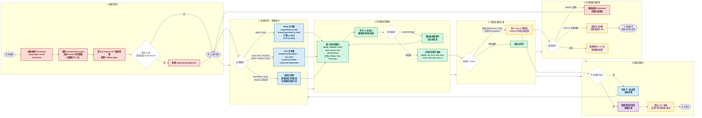

```mermaid
flowchart LR
 %% Partslink24 TPMS 爬蟲流程圖 — 簡報專用配色
    classDef phase_init fill:#FADBD8,stroke:#C0392B,stroke-width:2px,color:#641E16,font-weight:bold
    classDef phase_nav fill:#D6EAF8,stroke:#2980B9,stroke-width:2px,color:#154360,font-weight:bold
    classDef phase_parse fill:#D5F5E3,stroke:#27AE60,stroke-width:2px,color:#145A32,font-weight:bold
    classDef phase_save fill:#FCF3CF,stroke:#F39C12,stroke-width:2px,color:#7D3C98,font-weight:bold
    classDef phase_verify fill:#E8DAEF,stroke:#8E44AD,stroke-width:2px,color:#4A235A,font-weight:bold
    classDef decision fill:#FFFFFF,stroke:#7F8C8D,stroke-width:2px,stroke-dasharray:5 5

    subgraph Phase1 ["① 啟動與登入"]
        direction TB
        A([系統啟動]) --> B["啟動無頭 Chromium<br> playwright install chromium"]:::phase_init
        B --> C["移除 #usercentrics-root<br>突破 Cookie 同意彈窗<br>(反覆執行 3 次)"]:::phase_init
        C --> D["填入 Company ID / 帳號密碼<br>點擊 hidden-login"]:::phase_init
        D --> E{"等待 15 秒<br>是否需要 Squeezeout?"}:::decision
        E -- "是" --> F["點擊 squeezeout-login-btn"]:::phase_init
        E -- "否" --> G([進入目錄頁面])
        F --> G
    end

    subgraph Phase2 ["② 品牌導覽 — 雙軌模式"]
        direction TB
        G --> H{"品牌類型?"}:::decision
        H -- "BMW / MINI" --> I["BMW 式導覽<br>modelTable (x≈60)<br>modelTypeTable (x≈334)<br>引擎 (x>500)<br>ECE (x>600)"]:::phase_nav
        H -- "Audi / VW / Porsche<br>SEAT / Skoda / Cupra" --> J["VAG 式導覽<br>modelFamiliesTable → row click<br>modelYearTable<br>restrictionTable1/2/3"]:::phase_nav
        H -- "Mercedes / Volvo<br>Toyota / 日系車" --> K["通用式導覽<br>動態偵測可用表格<br>自動選擇最新年份"]:::phase_nav
    end

    subgraph Phase3 ["③ 智慧搜尋與解析"]
        direction TB
        I --> L["輸入搜尋關鍵字<br>BMW: 433MHz / RDC<br>VAG: Sensor für Reifendruck<br>日系: TPMS / Tire Pressure"]:::phase_parse
        J --> L
        K --> L
        L --> M["等待 12 秒載入<br>攔截動態渲染結果"]:::phase_parse
        M --> N{"搜尋結果?"}:::decision
        N -- "keine Einträge" --> O["嘗試備選關鍵字<br>或切換車款"]:::phase_parse
        N -- "有結果" --> P["正則提取零件號碼<br>BMW: XX XX X XXX XXX<br>VAG: XXX XXX XXX X"]:::phase_parse
        O --> L
    end

    subgraph Phase4 ["④ 智慧過濾與去重"]
        direction TB
        P --> Q{"是否為 TPMS?"}:::decision
        Q -- "包含 Reifendruck / RDC<br>排除 Steuergerät" --> R["寫入 SQLite 資料庫<br>UNIQUE 約束自動去重"]:::phase_save
        Q -- "不符條件" --> S["跳過此零件"]:::phase_parse
    end

    subgraph Phase5 ["⑥ 驗證與匯出"]
        direction TB
        R --> T{"所有品牌完成?"}:::decision
        T -- "否" --> U["切換下一個品牌<br>重新導覽"]:::phase_nav
        T -- "是" --> V["點擊零件詳情頁<br>截圖存證"]:::phase_verify
        V --> W["匯出 CSV 報表<br>品牌 / 零件號碼 / 描述"]:::phase_save
        W --> X([安全退出])
    end

    subgraph Phase4b ["⑤ 防護與斷點續爬"]
        direction TB
        R --> Y{"遭遇異常?"}:::decision
        Y -- "EPIPE / 超時" --> Z["重新啟動 Chromium<br>記錄失敗車款"]:::phase_init
        Y -- "Ctrl+C / 手動中斷" --> AA["緊急安全存檔<br>記錄進度至 DB"]:::phase_save
        Y -- "正常" --> AB["隨機等待 5-10 秒<br>避免觸發反爬"]:::phase_save
        Z --> G
        AA --> AC([下次啟動時<br>接續未完成品牌])
    end

    %% 跨區塊連結
    G --> Phase2
    Phase2 --> Phase3
    Phase3 --> Phase4
    Phase4 --> Phase4b
    Phase4 --> Phase5
    Phase4b --> Phase5
    U --> Phase2
```
