# Partslink24 TPMS 爬蟲技術報告 v4.0

> **爬蟲版本**：v4.0（支援記憶體/斷點續爬）
> **報告日期**：2026 年 7 月 24 日
> **Partslink24 存取帳號**：de-416440

---

## 一、專案概況

### 目標
從 Partslink24（歐洲汽車零件目錄系統）自動化爬取 **BMW 集團**（BMW、MINI）與 **Audi 集團**（Audi、VW、Porsche、SEAT、Skoda、Cupra）的 TPMS（胎壓監測系統）感測器零件號碼。

### 涵蓋範圍

| 集團 | 品牌 | 車款數量 | 搜尋關鍵字 | 導覽模式 |
|------|------|----------|-----------|---------|
| BMW | BMW | 11 個車系 | `433MHz` | BMW式 |
| BMW | MINI | 4 個車系 | `433MHz` | BMW式 |
| Audi | Audi | 9 個車款 | `Sensor für Reifendruck` | VAG式 |
| VW | Volkswagen | 8 個車款 | `Sensor für Reifendruck` | VAG式 |
| VW | Porsche | 4 個車款 | `Sensor für Reifendruck` | VAG式 |
| VW | SEAT | 5 個車款 | `Sensor für Reifendruck` | VAG式 |
| VW | Skoda | 6 個車款 | `Sensor für Reifendruck` | VAG式 |
| VW | Cupra | 4 個車款 | `Sensor für Reifendruck` | VAG式 |

### 技術棧
- **語言**：Python 3.12
- **瀏覽器自動化**：Playwright（headless Chromium）
- **資料儲存**：SQLite + CSV 匯出
- **平台**：macOS（Darwin）

---

## 二、完整流程圖（Mermaid）

```mermaid
flowchart LR
    %% Partslink24 TPMS 爬蟲流程圖 v4 — 完整版
    classDef phase_init fill:#FADBD8,stroke:#C0392B,stroke-width:2px,color:#641E16,font-weight:bold
    classDef phase_nav fill:#D6EAF8,stroke:#2980B9,stroke-width:2px,color:#154360,font-weight:bold
    classDef phase_parse fill:#D5F5E3,stroke:#27AE60,stroke-width:2px,color:#145A32,font-weight:bold
    classDef phase_save fill:#FCF3CF,stroke:#F39C12,stroke-width:2px,color:#7D3C98,font-weight:bold
    classDef phase_verify fill:#E8DAEF,stroke:#8E44AD,stroke-width:2px,color:#4A235A,font-weight:bold
    classDef decision fill:#FFFFFF,stroke:#7F8C8D,stroke-width:2px,stroke-dasharray:5 5
    classDef phase_memory fill:#D5F5E3,stroke:#1ABC9C,stroke-width:2px,color:#145A32,font-weight:bold

    subgraph Phase0 ["① 啟動前進度檢查"]
        direction TB
        START([系統啟動]) --> PROG{"讀取<br>scrape_progress.json"}:::decision
        PROG -- "檔案不存在" --> FRESH["全新週期<br>cycle_start = now"]:::phase_memory
        PROG -- "cycle_start < 7天" --> RESUME["接續執行<br>載入已完成清單"]:::phase_memory
        PROG -- "cycle_start > 7天" --> RESET["清空進度<br>開始全新週期"]:::phase_memory
        FRESH --> LAUNCH
        RESUME --> LAUNCH
        RESET --> LAUNCH
    end

    subgraph Phase1 ["② 啟動與登入"]
        direction TB
        LAUNCH["啟動無頭 Chromium<br>headless=True"]:::phase_init
        LAUNCH --> UC["移除 #usercentrics-root<br>突破 Cookie 同意彈窗<br>(反覆執行 3 次)"]:::phase_init
        UC --> LOGIN["填入 Company ID / 帳號密碼<br>Company: de-416440<br>點擊 hidden-login"]:::phase_init
        LOGIN --> WAIT{"等待 15 秒<br>是否需要 Squeezeout?"}:::decision
        WAIT -- "是" --> SQUEEZE["點擊 squeezeout-login-btn"]:::phase_init
        WAIT -- "否" --> READY([進入目錄頁面])
        SQUEEZE --> READY
    end

    subgraph Phase2 ["③ 品牌導覽 — 雙軌模式"]
        direction TB
        READY --> BRAND{"選擇品牌<br>BMW? VAG?"}:::decision
        BRAND -- "BMW / MINI" --> BMW_NAV["BMW 式導覽<br>① modelTable (x≈60)<br>② modelTypeTable (x≈334)<br>③ 引擎 (x>500)<br>④ ECE (x>600)"]:::phase_nav
        BRAND -- "Audi / VW / Porsche<br>SEAT / Skoda / Cupra" --> VAG_NAV["VAG 式導覽<br>① modelFamiliesTable<br>② row click [data-test-id]<br>③ modelYearTable<br>④ restrictionTable1/2/3"]:::phase_nav
    end

    subgraph Phase3 ["④ 智慧搜尋與解析"]
        direction TB
        BMW_NAV --> SEARCH["輸入搜尋關鍵字<br>BMW: 433MHz / RDC<br>VAG: Sensor für Reifendruck"]:::phase_parse
        VAG_NAV --> SEARCH
        SEARCH --> LOAD["等待 12 秒載入<br>攔截動態渲染結果"]:::phase_parse
        LOAD --> RESULT{"搜尋結果?"}:::decision
        RESULT -- "keine Einträge" --> NO_RESULT["嘗試備選關鍵字<br>或切換車款"]:::phase_parse
        RESULT -- "有結果" --> EXTRACT["正則提取零件號碼<br>BMW: XX XX X XXX XXX<br>VAG: XXX XXX XXX X"]:::phase_parse
        NO_RESULT --> SEARCH
    end

    subgraph Phase4 ["⑤ 智慧過濾與去重"]
        direction TB
        EXTRACT --> FILTER{"是否為 TPMS?"}:::decision
        FILTER -- "包含 Reifendruck / RDC<br>排除 Steuergerät" --> SAVE_DB["寫入 SQLite 資料庫<br>UNIQUE 約束自動去重<br>brand / series / model / pn"]:::phase_save
        FILTER -- "不符條件" --> SKIP["跳過此零件"]:::phase_parse
    end

    subgraph Phase5 ["⑥ 斷點記憶與週期管理"]
        direction TB
        SAVE_DB --> MARK["標記此車款已完成<br>mark_completed(brand, model)"]:::phase_memory
        MARK --> SAVE_JSON["儲存進度至<br>scrape_progress.json<br>包含: cycle_start, completed,<br>last_brand, last_model"]:::phase_memory
        SAVE_JSON --> NEXT{"下一個車款?"}:::decision
        NEXT -- "有更多車款" --> CHECK_DONE
        NEXT -- "所有車款完成" --> EXPORT
    end

    subgraph Phase6 ["⑦ 匯出與統計"]
        direction TB
        EXPORT["匯出 CSV 報表<br>tpms_YYYYMMDD_HHMMSS.csv"]:::phase_save
        EXPORT --> STATS["統計各品牌零件數<br>顯示唯一零件清單"]:::phase_save
        STATS --> DONE([安全退出])
    end

    subgraph Phase4b ["⑧ 防護與錯誤恢復"]
        direction TB
        CHECK_DONE{"檢查異常"}:::decision
        CHECK_DONE -- "EPIPE / 超時<br>運行 > 4小時" --> RESTART["重新啟動 Chromium<br>記錄失敗車款"]:::phase_init
        CHECK_DONE -- "Ctrl+C / SIGINT<br>SIGTERM" --> EMERGENCY["緊急安全存檔<br>signal_handler 觸發<br>graceful_stop = True"]:::phase_save
        CHECK_DONE -- "正常" --> WAIT_RAND["隨機等待 5-10 秒<br>避免觸發反爬"]:::phase_save
        RESTART --> READY
        EMERGENCY --> NEXT_START([下次啟動時<br>自動接續未完成品牌])
    end

    subgraph Phase8 ["⑨ 7天週期循環"]
        direction TB
        CYCLE{"每次啟動時檢查<br>距 cycle_start?"}:::decision
        CYCLE -- "< 7天" --> RESUME2["接續上次進度<br>跳過已完成車款"]:::phase_memory
        CYCLE -- "> 7天" --> RESET2["清空 completed<br>重新爬取所有品牌"]:::phase_memory
        CYCLE -- "== 7天整" --> FULL["完整重新驗證<br>確保資料最新"]:::phase_memory
    end

    %% 主流程連線
    START --> LAUNCH
    CHECK_DONE --> WAIT_RAND
    WAIT_RAND --> BRAND

    %% 跨區塊連線
    Phase0 --> Phase1
    Phase1 --> Phase2
    Phase2 --> Phase3
    Phase3 --> Phase4
    Phase4 --> Phase5
    Phase5 --> Phase4b
    Phase5 --> Phase6
    Phase4b --> Phase2
```



---

## 三、簡化流程圖（簡報用）

```mermaid
flowchart LR
    %% Partslink24 TPMS 爬蟲流程圖 — 簡化版
    classDef phase_init fill:#FADBD8,stroke:#C0392B,stroke-width:2px,color:#641E16,font-weight:bold
    classDef phase_nav fill:#D6EAF8,stroke:#2980B9,stroke-width:2px,color:#154360,font-weight:bold
    classDef phase_parse fill:#D5F5E3,stroke:#27AE60,stroke-width:2px,color:#145A32,font-weight:bold
    classDef phase_save fill:#FCF3CF,stroke:#F39C12,stroke-width:2px,color:#7D3C98,font-weight:bold
    classDef decision fill:#FFFFFF,stroke:#7F8C8D,stroke-width:2px,stroke-dasharray:5 5
    classDef phase_memory fill:#D5F5E3,stroke:#1ABC9C,stroke-width:2px,color:#145A32,font-weight:bold

    A([開始]) --> B["啟動 Chromium"]:::phase_init
    B --> C["登入帳號"]:::phase_init
    C --> D["檢查 7 天週期<br>scrape_progress.json"]:::phase_memory
    D --> E{"品牌類型?"}:::decision
    E -- "BMW / MINI" --> F["BMW 導覽<br>車系→車型→引擎→ECE"]:::phase_nav
    E -- "Audi / VW / Porsche<br>SEAT / Skoda / Cupra" --> G["VAG 導覽<br>車款→年份→限制條件"]:::phase_nav
    F --> H["搜尋 433MHz"]:::phase_parse
    G --> I["搜尋 Sensor<br>für Reifendruck"]:::phase_parse
    H --> J{"有結果?"}:::decision
    I --> J
    J -- "是" --> K["提取零件號碼<br>過濾 TPMS"]:::phase_parse
    J -- "否" --> L["切換車款"]:::phase_parse
    K --> M["寫入 SQLite<br>UNIQUE 去重"]:::phase_save
    M --> N["儲存進度<br>scrape_progress.json"]:::phase_memory
    N --> O{"下一個?"}:::decision
    O -- "有" --> E
    O -- "無" --> P["匯出 CSV"]:::phase_save
    P --> Q([結束])

    L --> E
```



---

## 四、程式設計架構

### 核心類別

```
┌─────────────────────────────────────────────┐
│                 Config                      │
│  ├── BASE_URL, LOGIN_URL                    │
│  ├── COMPANY_ID, USERNAME, PASSWORD         │
│  ├── DB_FILE, CSV_DIR, PROGRESS_FILE        │
│  ├── CYCLE_DAYS, MAX_RUNTIME_HOURS          │
│  └── BRANDS (dict: 品牌設定)                │
├─────────────────────────────────────────────┤
│              ProgressManager                │
│  ├── load/save  → 讀寫 scrape_progress.json │
│  ├── mark_completed() → 標記車款完成        │
│  ├── is_completed() → 檢查是否已爬取        │
│  ├── should_reset() → 7天週期檢查           │
│  └── reset() → 清空進度重新開始             │
├─────────────────────────────────────────────┤
│                   DB                        │
│  ├── __init__()  → 建立 SQLite 資料表       │
│  ├── add()       → 新增感測器記錄           │
│  ├── count()     → 統計總筆數               │
│  ├── by_brand()  → 按品牌統計               │
│  ├── unique_parts() → 去重零件清單          │
│  └── export()    → 匯出 CSV                 │
├─────────────────────────────────────────────┤
│                 Scraper                     │
│  ├── login()     → 自動登入                 │
│  ├── goto_brand() → 切換品牌目錄            │
│  ├── click_sel() → CSS 選擇器空間定位       │
│  ├── search()    → 搜尋零件                 │
│  ├── scrape_bmw() → BMW 式導覽              │
│  ├── scrape_vag() → VAG 式導覽              │
│  ├── extract_bmw() → BMW 格式解析           │
│  ├── extract_vag() → VAG 格式解析           │
│  ├── filter_tpms() → TPMS 過濾             │
│  └── run()       → 主迴圈 + 進度管理        │
└─────────────────────────────────────────────┘
```

### 兩種導覽模式

Partslink24 是一個 React SPA（單頁應用），BMW 和 VAG 集團使用**不同的導覽結構**：

**BMW 式導覽**（BMW、MINI）——多欄表格空間佈局：
```
modelTable (x≈60) → modelTypeTable (x≈334) → 引擎 (x>500) → ECE (x>600)
```

**VAG 式導覽**（Audi/VW/Porsche/SEAT/Skoda/Cupra）——層級行點擊：
```
modelFamiliesTable → [data-test-id="row"] click
  → modelYearTable → restrictionTable1 → restrictionTable2 → restrictionTable3
```

---

## 五、技術問題與解決方法

### 問題 1：Usercentrics Cookie 同意彈窗阻擋操作

**現象**：頁面上出現 `#usercentrics-root` 影子 DOM 元素，擋住所有滑鼠事件。

**解決**：反覆執行 JS 移除該元素（3次確保完全移除）：
```python
async def uc(self):
    await self.page.evaluate(
        '() => { const u = document.querySelector("#usercentrics-root"); if (u) u.remove(); }')
```

---

### 問題 2：CSS 模組選擇器格式

**現象**：`querySelectorAll('[class* "_selectable_"]')` 拋出 `SyntaxError`。

**解決**：必須使用 `[class*="_selectable_"]`（有等號）：
```python
SEL = '[class*="_selectable_"]'  # 正確
```

---

### 問題 3：BMW 車型選擇錯誤（選到 M 系列或老車）

**解決**：優先選擇 G/F/U 開頭的現代非 M 車型：
```python
for m in models:
    code = m.split('(')[0].strip().upper()
    is_m = 'M3' in code or 'M4' in code or 'M5' in code
    if not is_m and any(p in code for p in ['G2','G3','F2','F3','F4','F5','F6','F7','U1','U2']):
        model = m; break
```

---

### 問題 4：部分車款搜尋不到 TPMS 感測器

**原因**：這些車款使用**間接式 TPMS**（Indirect TPMS），依靠 ABS 車速感測器運算胎壓變化，不需要獨立的胎壓感測器零件。

**確認有直接式感測器的車款**：
- VW：Tiguan、Touareg、Arteon
- Skoda：Kodiaq、Octavia
- SEAT：Leon

---

### 問題 5：Playwright 長時間執行後 EPIPE 錯誤

**現象**：執行超過 10 分鐘後出現 `Error: write EPIPE` 並崩潰。

**解決**：將大型爬蟲任務拆分為多個小批次執行，或加入錯誤處理與重試機制。

---

## 六、已確認的 TPMS 感測器零件號碼

### BMW 集團（433MHz 直接式）

| 品牌 | 零件號碼 | 描述 | 備註 |
|------|---------|------|------|
| BMW | `36 10 6 856 227` | Radelektronikmodul RDC 433MHz | LOW COST，橘色 |
| BMW | `36 10 6 890 964` | Radelektronikmodul RDC 433MHz | 目前使用 |
| BMW | `36 10 6 874 830` | Radelektronikmodul RDC 433MHz | |
| BMW | `36 10 6 874 829` | Radelektronikmodul RDC 433MHz | |
| BMW | `36 14 6 792 829/830/831` | Schraubventil RDC | 氣門嘴（標準/綠/黃） |
| MINI | 同 BMW | 同上 | MINI 使用 BMW 感測器 |

### BMW 集團（間接式 RDCi）

| 零件號碼 | 描述 | 備註 |
|---------|------|------|
| `36 10 6 881 890` | Radelektronikmodul RDCi m. Schraubventil | 搭配 ABS |
| `36 14 6 867 031` | Ventileinsatz RDCi | 氣門嘴內芯 |
| `36 14 6 867 030` | Ventilkappe RDCi | 氣門嘴蓋 |

### Audi 集團（直接式）

| 品牌 | 零件號碼 | 描述 | 適用車款 |
|------|---------|------|---------|
| Audi | `95C 907 255` | Sensor für Reifendruck | A3 (2025) |
| Audi | `5Q0 907 275 F` | Sensor für Reifendruck | A3 |
| Audi | `9J1 907 255/D` | Sensor für Reifendruck | A3 |
| VW | `5Q0 907 275 G` | Sensor für Reifendruck | Tiguan (2020+) |
| VW | `5Q0 907 275 H` | Sensor für Reifendruck | Touareg |
| VW | `5Q0 907 275 C/B/F` | Sensor für Reifendruck | Tiguan/Arteon |
| SEAT | `5FA 837 901 F` | Sensor für Reifendruck | Leon/Cupra |
| Skoda | `5Q0 907 275 F` | Sensor für Reifendruck | Kodiaq |
| Skoda | `5E3 010 000 L` | Sensor für Reifendruck | Octavia |
| Skoda | `81A 907 660 B` | Sensor für Reifendruck | Octavia |
| Porsche | `PAD 907 255 A/B/C` | Sensor für Reifendruck | Macan |
| Porsche | `PAB 907 275/A` | Sensor für Reifendruck | Taycan |
| Porsche | `9J1 907 275 A/B/C` | Sensor für Reifendruck | Taycan |

### 沒有直接式 TPMS 的車款

VW Golf、Polo、T-Roc、ID.3、ID.4、ID.5、Caddy、Taigo、Amarok、SEAT Ibiza、Arona、Skoda Fabia 等車款在 Partslink24 中**找不到直接式 TPMS 感測器零件**，推測使用間接式 TPMS。

---

## 七、v4.0 新增功能：記憶體與斷點續爬

### 7天週期系統

**進度檔案格式（scrape_progress.json）：**
```json
{
    "cycle_start": 1721827200.0,
    "completed": ["bmw:3'", "bmw:5'", "audi:Audi A3"],
    "last_brand": "vw",
    "last_model": "Tiguan",
    "total_scraped": 42,
    "last_save": 1721830800.0
}
```

**7天週期邏輯：**
```
每次啟動：
  1. 讀取 scrape_progress.json
  2. 如果 cycle_start 不存在 → 全新開始
  3. 如果 cycle_start < 7天 → 接續執行，跳過已完成車款
  4. 如果 cycle_start > 7天 → 清空進度，重新開始
```

### 優雅中斷處理

**Signal Handler：**
```python
graceful_stop = False

def _signal_handler(sig, frame):
    global graceful_stop
    graceful_stop = True
    print("\n[Signal] 收到中斷訊號，正在安全關閉...", flush=True)

signal.signal(signal.SIGINT, _signal_handler)
signal.signal(signal.SIGTERM, _signal_handler)
```

**斷點跳過邏輯：**
```python
async def scrape_bmw(self, key):
    for series in cfg['series']:
        if graceful_stop or self.timeout():
            return

        # 斷點跳過：如果此車款已完成，跳過
        if self.progress.is_completed(key, series):
            print(f"  {series}: [skip] 已完成", flush=True)
            continue

        # ... 爬取邏輯 ...

        # 標記完成並儲存進度
        self.progress.mark_completed(key, series)
        self.progress.save(brand=key, model=series, count_add=part_count)
```

### CLI 命令

```bash
# 執行全部品牌
python3 partslink_tpms.py

# 只跑特定品牌
python3 partslink_tpms.py --brands bmw audi vw

# 查看進度檔案
python3 partslink_tpms.py --progress

# 查看目前狀態
python3 partslink_tpms.py --status

# 強制清空進度重新開始
python3 partslink_tpms.py --reset
```

---

## 八、附錄

### 檔案結構
```
partslink24/
├── partslink_tpms.py          # 主程式 v4.0
├── explore_brands.py          # 品牌探索工具
├── partslink_tpms.db          # SQLite 資料庫
├── scrape_progress.json       # 進度檔案（7天週期）
└── TPMS_Exports/
    ├── tpms_*.csv             # CSV 匯出
    ├── 技術報告.md             # 本報告
    └── screenshots/           # 截圖存證
        ├── details/           # 零件詳情頁截圖
        └── verified/          # 驗證截圖
```

### 截圖存證
所有截圖存放於 `TPMS_Exports/screenshots/` 目錄：

| 目錄 | 內容 |
|------|------|
| `screenshots/` | 各品牌搜尋結果頁截圖 |
| `screenshots/details/` | 各零件詳情頁截圖 |
| `screenshots/verified/` | 全面驗證截圖 |

---

*報告完成：2026 年 7 月 24 日*
