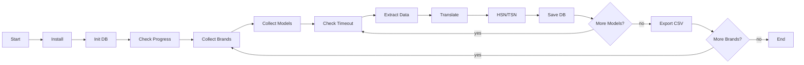
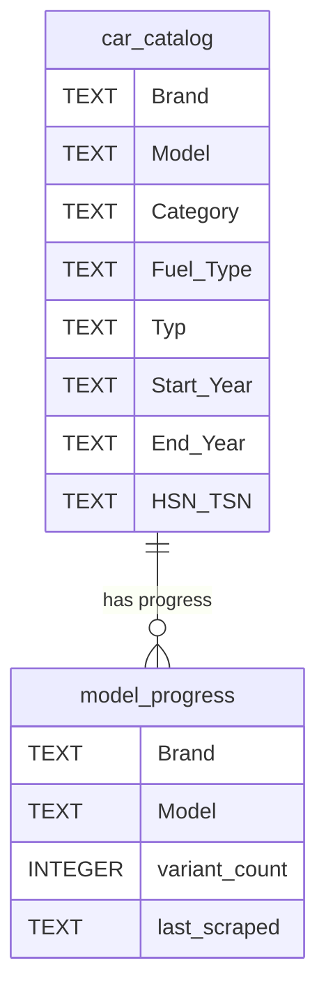

AutoBild 爬蟲系統 v11.0 流程圖
================================

【Mermaid 格式 - 可貼到 GitHub README.md】

```mermaid
flowchart TD
    Start([Start]) --> InstallPkg[Install Packages]
    
    InstallPkg --> CheckCmd{Check Arguments}
    CheckCmd -- "--reset" --> ResetDB[(Reset DB)] --> End
    CheckCmd -- "--status" --> ShowStatus[(Show Stats)] --> End
    CheckCmd -- "--test" --> SetTestMode[Test Mode]
    CheckCmd -- "--brand" --> SetBrand[Brand Mode]
    CheckCmd -- "none" --> SetFullMode[Full Mode]
    
    SetTestMode --> InitDB
    SetBrand --> InitDB
    SetFullMode --> InitDB
    
    InitDB[(Init DB)]
    
    InitDB --> CheckProgress{Check Progress}
    CheckProgress -- "has record" --> ResumeMode[Resume]
    CheckProgress -- "no record" --> FullMode[Full Scan]
    
    ResumeMode --> LaunchBrowser
    FullMode --> LaunchBrowser
    
    LaunchBrowser[Launch Browser]
    
    LaunchBrowser --> CollectBrands[Collect Brands]
    
    CollectBrands --> BrandLoop[Brand Loop]
    
    BrandLoop --> CheckTimeout1{Timeout?}
    CheckTimeout1 -- "yes" --> Timeout([Timeout])
    CheckTimeout1 -- "no" --> EnterBrand[Enter Brand]
    
    EnterBrand --> CollectModels[Collect Models]
    
    CollectModels --> ModelLoop[Model Loop]
    
    ModelLoop --> CheckTimeout2{Timeout?}
    CheckTimeout2 -- "yes" --> Timeout
    CheckTimeout2 -- "no" --> CheckProgress2{Check Skip}
    
    CheckProgress2 -- "skip" --> SkipModel[Skip] --> ModelLoop
    CheckProgress2 -- "continue" --> GotoModel[Go to Model]
    
    GotoModel --> ScrollPage[Scroll Page]
    
    ScrollPage --> CheckVariants{Has Variants?}
    
    CheckVariants -- "no" --> ExtractSingle[Extract Single]
    
    CheckVariants -- "yes" --> ExpandAll[Expand All]
    
    ExpandAll --> ExtractData[Extract Data]
    ExtractSingle --> BuildRecords
    
    ExtractData --> BuildRecords[Build Records]
    
    BuildRecords --> TranslateData[Translate to Chinese]
    
    TranslateData --> LoopRecords[Loop Records]
    
    LoopRecords --> CheckTimeout3{Timeout?}
    CheckTimeout3 -- "yes" --> Timeout
    CheckTimeout3 -- "no" --> TryHSN{Try HSN/TSN}
    
    TryHSN -- "yes" --> ClickVariant[Click Variant]
    ClickVariant --> WaitAPI[Wait API]
    WaitAPI --> CheckAPI{Has HSN/TSN?}
    CheckAPI -- "yes" --> SetHSN[Set HSN/TSN]
    CheckAPI -- "no" --> CheckDOM{Check DOM}
    CheckDOM -- "yes" --> SetHSN
    CheckDOM -- "no" --> CloseOverlay[Close Overlay]
    
    SetHSN --> AddBatch[Add to Batch]
    CloseOverlay --> AddBatch
    TryHSN -- "no" --> AddBatch
    
    AddBatch --> CheckBatch{Batch > 50?}
    CheckBatch -- "yes" --> SaveDB[(Save DB)]
    SaveDB --> ClearBatch[Clear Batch] --> LoopRecords
    CheckBatch -- "no" --> LoopRecords
    
    LoopRecords -- "done" --> FlushBatch[(Flush Batch)]
    FlushBatch --> UpdateProgress[(Update Progress)]
    
    UpdateProgress --> ModelLoop
    
    ModelLoop -- "done" --> ExportCSV[(Export CSV)]
    ExportCSV --> BrandLoop
    
    BrandLoop -- "done" --> CloseBrowser[Close Browser]
    
    CloseBrowser --> Finalize[Finalize]
    
    Finalize --> End([End])
    Timeout --> SaveTemp[(Save Temp)] --> End
```

---

【簡化版流程圖】

```mermaid
flowchart LR
    A[Start] --> B[Install]
    B --> C[Init DB]
    C --> D[Check Progress]
    D --> E[Collect Brands]
    E --> F[Collect Models]
    F --> G[Check Timeout]
    G --> H[Extract Data]
    H --> I[Translate]
    I --> J[HSN/TSN]
    J --> K[Save DB]
    K --> L{More Models?}
    L -- "yes" --> G
    L -- "no" --> M[Export CSV]
    M --> N{More Brands?}
    N -- "yes" --> E
    N -- "no" --> O[End]
```

---

【資料庫 Schema】

```mermaid
erDiagram
    car_catalog {
        TEXT Brand
        TEXT Model
        TEXT Category
        TEXT Fuel_Type
        TEXT Typ
        TEXT Start_Year
        TEXT End_Year
        TEXT HSN_TSN
    }
    
    model_progress {
        TEXT Brand
        TEXT Model
        INTEGER variant_count
        TEXT last_scraped
    }
    
    car_catalog ||--o{ model_progress : "has progress"
```
