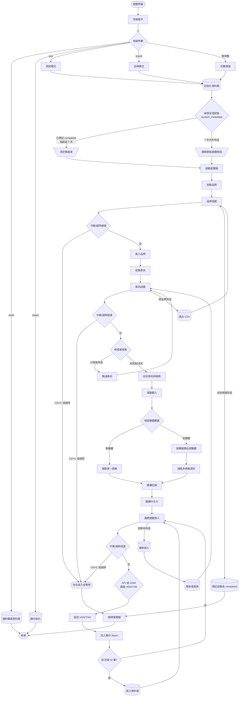

AutoBild 爬蟲系統 v11.0 流程圖
================================

【完整流程圖】



---
【簡化版流程圖 / 技術架構展示】

```mermaid
flowchart LR
    %% 簡報專用配色與樣式設定
    classDef phase_init fill:#FADBD8,stroke:#C0392B,stroke-width:2px,color:#641E16,font-weight:bold
    classDef phase_nav fill:#D6EAF8,stroke:#2980B9,stroke-width:2px,color:#154360,font-weight:bold
    classDef phase_parse fill:#D5F5E3,stroke:#27AE60,stroke-width:2px,color:#145A32,font-weight:bold
    classDef phase_save fill:#FCF3CF,stroke:#F39C12,stroke-width:2px,color:#7D3C98,font-weight:bold
    classDef decision fill:#FFFFFF,stroke:#7F8C8D,stroke-width:2px,stroke-dasharray: 5 5

    subgraph Phase1 ["① 啟動與智慧接續"]
        direction TB
        A([系統啟動]) --> B{"7日/完工檢查"}:::decision
        B -- "過期 / 已完工" --> C["清空進度<br>全新掃描"]:::phase_init
        B -- "7日內中斷" --> D["載入斷點<br>接續掃描"]:::phase_init
    end

    subgraph Phase2 ["② 動態渲染與自動化 (Playwright)"]
        direction TB
        E["啟動無頭瀏覽器<br>(自動突破 Cookie 彈窗)"]:::phase_nav --> F["模擬真人滾動網頁<br>(觸發 Lazy Loading)"]:::phase_nav
        F --> G["操作 DOM 元素<br>(暴力展開所有隱藏車系)"]:::phase_nav
    end

    subgraph Phase3 ["③ 深度資料萃取與攔截"]
        direction TB
        H["背景攔截動態 API<br>(精準抓取 HSN/TSN)"]:::phase_parse --> I["解析網頁底層 JSON<br>(車身/年份/馬力)"]:::phase_parse
        I --> J["多國語言翻譯<br>(德文 ➔ 中文)"]:::phase_parse
    end

    subgraph Phase4 ["④ 防護與永久保存"]
        direction TB
        K{"遭遇超時 / Ctrl+C?"}:::decision
        K -- "是 (觸發防護)" --> L[(緊急安全存檔)]:::phase_save
        K -- "否 (平穩運行)" --> M[(批次寫入資料庫)]:::phase_save
        L --> O([安全退出])
        M --> N["匯出 品牌.csv"]:::phase_save
        N --> O
    end

    %% 跨區塊的動線連結
    C --> E
    D --> E
    G --> H
    J --> K
```


```

---

erDiagram
    car_catalog {
        TEXT Brand
        TEXT Model
        TEXT Category
        TEXT Fuel_Type
        TEXT Typ
        TEXT Start_Year
        TEXT End_Year
        TEXT HSN_TSN
    }
    
    model_progress {
        TEXT Brand
        TEXT Model
        INTEGER variant_count
        TEXT last_scraped
    }
    
    system_metadata {
        TEXT key PK
        TEXT value
    }
    
    car_catalog ||--o{ model_progress : "has progress"
    
    car_catalog ||--o{ model_progress : "has progress"
```
