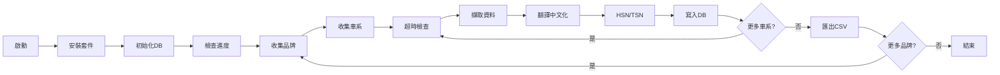
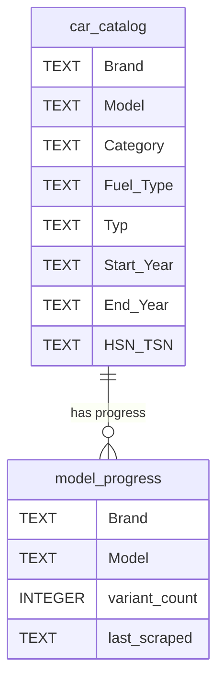

AutoBild 爬蟲系統 v11.0 流程圖
================================

【完整流程圖】

```mermaid
flowchart TD
    Start([啟動爬蟲]) --> InstallPkg[安裝套件]
    
    InstallPkg --> CheckCmd{檢查參數}
    CheckCmd -- reset --> ResetDB[(重置資料庫)] --> End
    CheckCmd -- status --> ShowStatus[(顯示統計)] --> End
    CheckCmd -- test --> SetTestMode[測試模式]
    CheckCmd -- brand --> SetBrand[品牌模式]
    CheckCmd -- 無參數 --> SetFullMode[完整掃描]
    
    SetTestMode --> InitDB
    SetBrand --> InitDB
    SetFullMode --> InitDB
    
    InitDB[(初始化資料庫)]
    
    InitDB --> CheckProgress{檢查進度}
    CheckProgress -- 有記錄 --> ResumeMode[繼續模式]
    CheckProgress -- 無記錄 --> FullMode[全面模式]
    
    ResumeMode --> LaunchBrowser
    FullMode --> LaunchBrowser
    
    LaunchBrowser[啟動瀏覽器]
    
    LaunchBrowser --> CollectBrands[收集品牌]
    
    CollectBrands --> BrandLoop[品牌迴圈]
    
    BrandLoop --> CheckTimeout1{超時檢查}
    CheckTimeout1 -- 是 --> Timeout([安全暫停])
    CheckTimeout1 -- 否 --> EnterBrand[進入品牌]
    
    EnterBrand --> CollectModels[收集車系]
    
    CollectModels --> ModelLoop[車系迴圈]
    
    ModelLoop --> CheckTimeout2{超時檢查}
    CheckTimeout2 -- 是 --> Timeout
    CheckTimeout2 -- 否 --> CheckProgress2{檢查跳過}
    
    CheckProgress2 -- 跳過 --> SkipModel[略過] --> ModelLoop
    CheckProgress2 -- 繼續 --> GotoModel[前往車系]
    
    GotoModel --> ScrollPage[滾動載入]
    
    ScrollPage --> CheckVariants{檢查變體}
    
    CheckVariants -- 無變體 --> ExtractSingle[擷取單一]
    
    CheckVariants -- 有變體 --> ExpandAll[展開全部]
    
    ExpandAll --> ExtractData[擷取資料]
    ExtractSingle --> BuildRecords
    
    ExtractData --> BuildRecords[建構記錄]
    
    BuildRecords --> TranslateData[翻譯中文化]
    
    TranslateData --> LoopRecords[遍歷變體]
    
    LoopRecords --> CheckTimeout3{超時檢查}
    CheckTimeout3 -- 是 --> Timeout
    CheckTimeout3 -- 否 --> TryHSN{擷取HSN/TSN}
    
    TryHSN -- 是 --> ClickVariant[點擊變體]
    ClickVariant --> WaitAPI[等待回應]
    WaitAPI --> CheckAPI{檢查API}
    CheckAPI -- 有 --> SetHSN[設定HSN/TSN]
    CheckAPI -- 無 --> CheckDOM{檢查DOM}
    CheckDOM -- 有 --> SetHSN
    CheckDOM -- 無 --> CloseOverlay[關閉彈窗]
    
    SetHSN --> AddBatch[加入暫存]
    CloseOverlay --> AddBatch
    TryHSN -- 否 --> AddBatch
    
    AddBatch --> CheckBatch{批次檢查}
    CheckBatch -- 超過50筆 --> SaveDB[(寫入資料庫)]
    SaveDB --> ClearBatch[清空暫存] --> LoopRecords
    CheckBatch -- 未滿 --> LoopRecords
    
    LoopRecords -- 完成 --> FlushBatch[(強制寫入)]
    FlushBatch --> UpdateProgress[(更新進度)]
    
    UpdateProgress --> ModelLoop
    
    ModelLoop -- 完成 --> ExportCSV[(匯出CSV)]
    ExportCSV --> BrandLoop
    
    BrandLoop -- 完成 --> CloseBrowser[關閉瀏覽器]
    
    CloseBrowser --> Finalize[完成]
    
    Finalize --> End([結束])
    Timeout --> SaveTemp[(儲存暫存)] --> End
```

---

【簡化版流程圖】

```mermaid
flowchart LR
    A[啟動] --> B[安裝套件]
    B --> C[初始化DB]
    C --> D[檢查進度]
    D --> E[收集品牌]
    E --> F[收集車系]
    F --> G[超時檢查]
    G --> H[擷取資料]
    H --> I[翻譯中文化]
    I --> J[HSN/TSN]
    J --> K[寫入DB]
    K --> L{更多車系?}
    L -- 是 --> G
    L -- 否 --> M[匯出CSV]
    M --> N{更多品牌?}
    N -- 是 --> E
    N -- 否 --> O[結束]
```

---

【資料庫 Schema】

```mermaid
erDiagram
    car_catalog {
        TEXT Brand
        TEXT Model
        TEXT Category
        TEXT Fuel_Type
        TEXT Typ
        TEXT Start_Year
        TEXT End_Year
        TEXT HSN_TSN
    }
    
    model_progress {
        TEXT Brand
        TEXT Model
        INTEGER variant_count
        TEXT last_scraped
    }
    
    car_catalog ||--o{ model_progress : "has progress"
```
